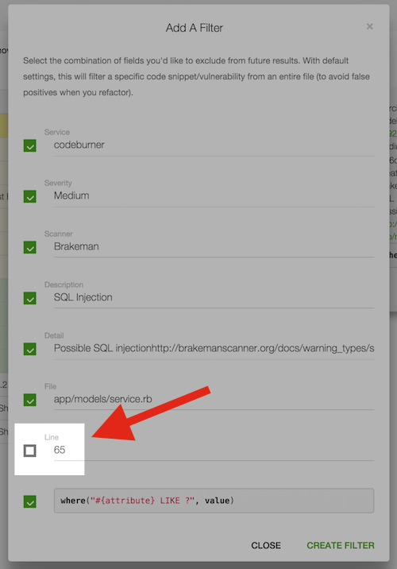
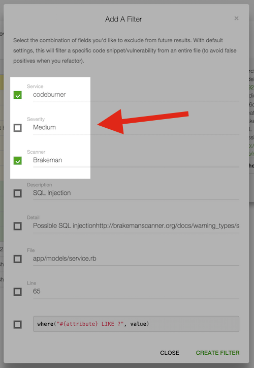
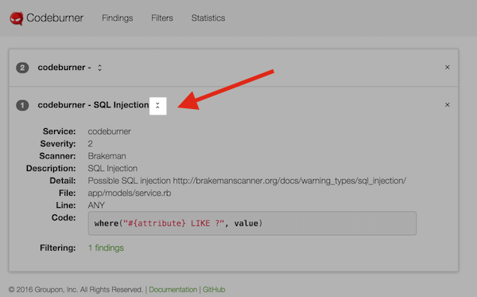
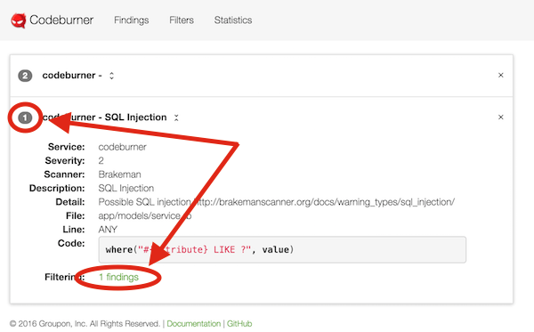
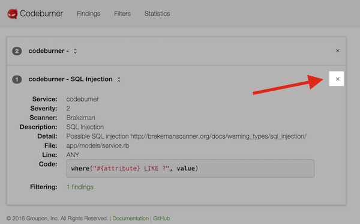

## Filtering vs. Hiding
As mentioned in the [Findings](/user/findings/) documentation, hiding a finding is limited to that **exact** finding, right down to line number.  There will often be times when you want to exclude a finding from anywhere in the file, or exclude findings from a specific scanner or pertaining to a specific vulnerability, etc.

Filtering allows you to both hide existing issues and filter out future results matching certain criteria in a flexible way.

***

## Create a filter
You can use the filtering interface to generate an exclusion filter for existing and future results based on any combination of fields you want.

The default behavior selects every field **except** line number, meaning it will match that result anywhere in the file (and therefore catch it if you refactor and change line numbers).

As a more advanced example, let's say you wanted to filter every finding from a specific scanner (in this example Brakeman) for your service.  If you select just the fields "Service Name" and "Scanner" you'll do just that:

!!! Note
    The filtering interface is flexible enough that you can in fact filter every result for every service (by creating a filter with everything unchecked).  While this is easily undone by simply deleting the offending filter, it's worth noting and is one of many possibilities afforded by the flexibility of the system.

***

## View existing filters
You can view the currently active filters by clicking on the "Filters" option in the nav bar, or by visiting the URL <a href="http://localhost:8080/#filter">http://localhost:8080/#filter</a>

Click the "expand" button to show more details about a specific filter:

Clicking it on an expanded filter collapses it again:

If you click either the numbered badge or the "N findings" link next to the "Filtering:" heading you'll be taken to the findings page and shown **just the findings filtered by that filter**:

***

## Delete a filter
You can click the "X" icon to delete a filter.  Deleting a filter will also set the status of any issues caught by that filter back to "open".

***
